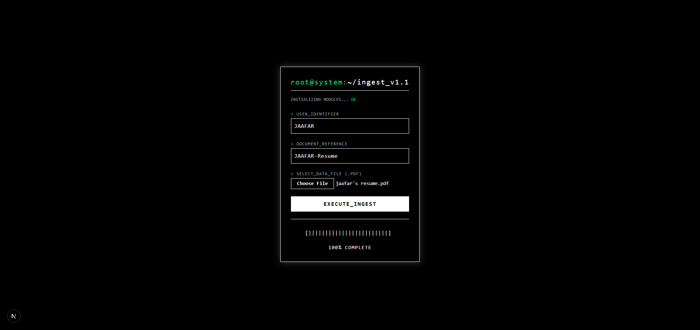
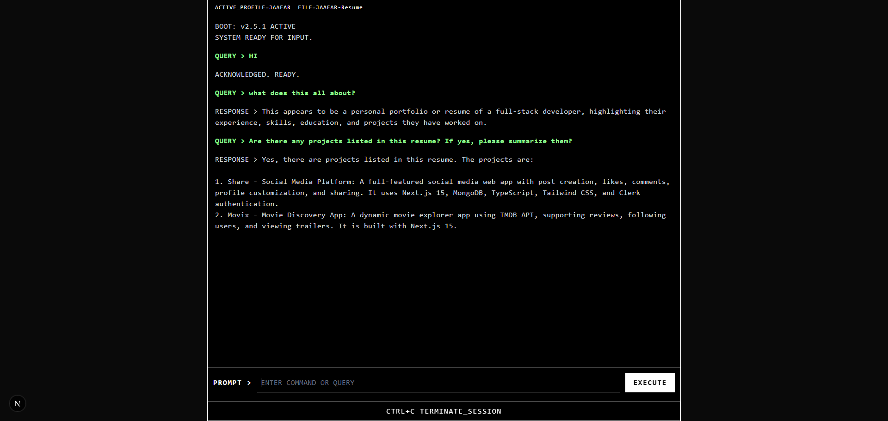
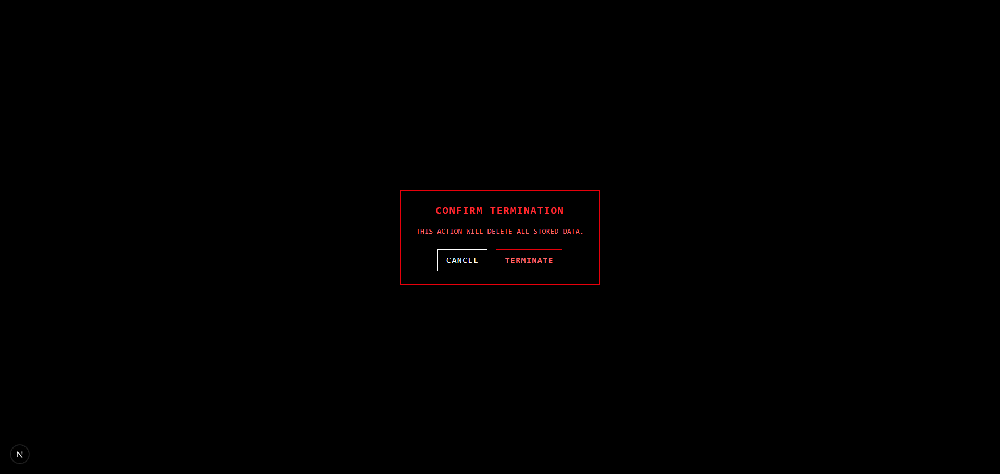

# **PDF RAG Terminal (Next.js 15)**

A terminal-style document intelligence system built with **Next.js 15**, **Jina Embeddings**, **Pinecone**, **Groq LLaMA 3.3**, and **Cloudinary**.

The application allows you to:

- Upload PDF files
- Extract and clean PDF text
- Auto-chunk content dynamically
- Generate embeddings of Extracted text
- Store vectors in Pinecone
- Query the PDF using natural language
- Stream AI responses in real-time
- Enforce safe, context-only answers

---

## **Features**

### **PDF Upload (Cloudinary RAW)**

Uploads PDF files using Cloudinary’s raw resource mode.

### **Text Extraction & Cleaning**

Text extraction is performed using `pdf-parse-fixed`, a Node-only PDF parser that works reliably on Vercel without requiring any DOM, canvas, or worker polyfills. This ensures fast, unlimited, and cost-free text extraction for all uploaded PDFs.

### **Adaptive Chunking**

Automatic chunk-size calculation (500–1800 chars) with ~12% overlap.

### **High-Speed Jina Embeddings**

Multi-chunk embedding using 20 concurrent Jina API calls.

### **Pinecone Vector Indexing**

Each chunk is stored with:

- `profile`
- `file`
- `text`

Supports filtered similarity search.

### **RAG Query Pipeline**

1. Normalize query text
2. Embed query
3. Pinecone similarity search
4. Return context
5. Stream LLaMA response

### **Context Guardrail**

If the answer is not in the PDF:

### **Terminal UI**

- White terminal-style progress bar
- Upload → Parsing → Embedding progress
- Real-time streamed answers
- `CTRL+C` session termination

---

## **API Limitations**

- Jina embeddings rate limits
- Groq request limits
- Pinecone query/write caps
- Cloudinary file size limits

Avoid spamming uploads or excessive PDF reprocessing.

---

## **Overview**

---

## **Links**

**Live Site:** [DocShadow](https://doc-shadow.vercel.app/)

---

## **Technologies Used**

- **Next.js 15**
- **TypeScript**
- **Jina Embeddings v2**
- **Pinecone**
- **Groq LLaMA 3.3**
- **Cloudinary RAW**
- **pdf-parse-fixed**
- **Tailwind CSS**

---

## **Author**

- LinkedIn – [Jaafar Youssef](https://www.linkedin.com/in/jaafar-youssef-923100249/)

---

## **License**

For learning and personal use only.  
Not intended for heavy industrial document processing.
